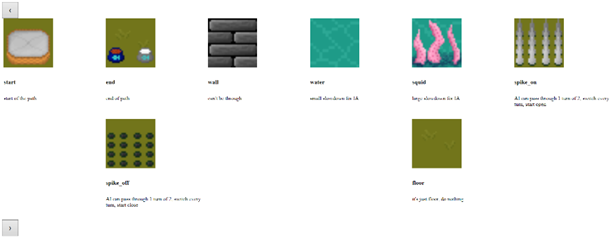

# CAT’S PUZZLE AVENTURE

Par
[Chevalier Maxime](https://github.com/MaxChevalier)
et
[Raynaud Adrien](https://github.com/Adrienraynaudd)

---

## Pitch du Projet :

Nous sommes enthousiastes de vous présenter notre nouveau projet de jeu vidéo, "Cat's Puzzle Adventure", une expérience engageante et stimulante qui mêle stratégie et aventure dans un univers captivant.

Dans "Cat's Puzzle Adventure", les joueurs accompagnent un adorable chat dans une aventure passionnante. Le jeu propose un défi intrigant : remplir une grille de jeu avec des tuiles fournies, tout en planifiant chaque mouvement pour ralentir au maximum l'avancée de l'IA adverse. Cette mécanique unique offre des heures de réflexion et de divertissement, où chaque décision compte dans la course pour la victoire.

L'univers du jeu est inspiré d'un marais, offrant des paysages mystérieux et envoûtants à explorer. Le héros, notre petit chat, saute agilement de son panier à sa gamelle, ajoutant une touche de charme à l'aventure.

Notre équipe est dévouée à fournir une expérience de jeu de qualité, mettant l'accent sur le plaisir et le défi. Avec ses mécanismes de jeu innovants et son ambiance immersive, "Cat's Puzzle Adventure" promet d'être une expérience captivante pour les amateurs de jeux de réflexion et d'aventure.

Préparez-vous à plonger dans une aventure palpitante où votre intelligence et votre stratégie seront mises à l'épreuve. Rejoignez notre charmant compagnon à quatre pattes dans cette quête épique et vivez des moments inoubliables dans "Cat's Puzzle Adventure". 

---
## L’équipe :

Au sein de notre équipe composée de deux membres, Adrien Raynaud et Maxime Chevalier, nous avons adopté une approche organisée pour répartir efficacement les tâches. Nous avons utilisé l'outil "Notion" pour gérer nos tâches et suivre notre progression tout au long du projet.

La répartition des tâches s'est déroulée comme suit : Adrien s'est concentré sur le développement du backend et de l'API. Cela comprenait la gestion de la base de données SQLite, la configuration de l'ORM Sequelize pour simplifier l'accès aux données, la mise en place des routes et des contrôleurs pour gérer les requêtes HTTP, ainsi que la mise en œuvre de l'authentification via des tokens JWT (JSON Web Tokens). Il a également pris en charge l'implémentation de l'authentification côté frontend.

De son côté, Maxime s'est occupé de la partie "jeu" du projet. Il a développé un algorithme basé sur le modèle A* pour gérer l'intelligence artificielle du jeu. En ce qui concerne le frontend, il a travaillé sur l'interface utilisateur du tableau de jeu. Cela comprend la sélection du niveau, l'affichage de la grille de jeu, la possibilité de modifier la grille et l'animation de la résolution du jeu.

Cette répartition des tâches nous a permis de travailler de manière efficace et collaborative, en tirant parti des forces et des compétences spécifiques de chaque membre de l'équipe.

---
## Technologie :

Pour le développement du projet, nous avons opté pour une approche technologique variée et complémentaire. Tout d'abord, pour la mise en place du backend, nous avons choisi JavaScript en conjonction avec Node.js. Node.js est un environnement d'exécution JavaScript côté serveur qui permet de créer des applications web évolutives et rapides. L'utilisation de JavaScript pour le backend offre une grande cohérence de langage entre le frontend et le backend, simplifiant ainsi le processus de développement et de maintenance.

En ce qui concerne la gestion des données, nous avons opté pour SQLite comme système de gestion de base de données. SQLite est un moteur de base de données relationnelle léger et autonome, idéal pour les applications nécessitant une solution de stockage de données simple et facile à déployer. Sa portabilité et sa simplicité en font un choix judicieux pour les projets de taille moyenne ou ceux nécessitant une distribution sur plusieurs plateformes.

Pour faciliter les opérations de manipulation des données entre la base de données et le backend, nous avons intégré Sequelize comme ORM (Object-Relational Mapping). Sequelize est un ORM JavaScript qui prend en charge plusieurs dialectes SQL et simplifie l'accès et la manipulation des données dans une base de données relationnelle. En utilisant Sequelize, nous avons pu écrire du code JavaScript pour interagir avec la base de données, ce qui a accéléré le développement et amélioré la maintenabilité de notre application.

Enfin, pour la création de l'interface utilisateur, nous avons choisi TypeScript en combinaison avec le framework Angular. TypeScript est une surcouche de typage statique pour JavaScript, ce qui permet de détecter les erreurs de manière précoce et d'améliorer la qualité du code. Angular, quant à lui, est un framework de développement web développé par Google, offrant une structure robuste et des fonctionnalités avancées pour la création d'applications web monopages (SPA). Avec Angular, nous avons pu créer une interface utilisateur dynamique et réactive, tout en bénéficiant de fonctionnalités telles que le routage, la gestion des formulaires et la modularité de l'application.

En combinant ces différentes technologies, nous avons pu développer un projet web moderne, performant et évolutif, tout en bénéficiant de la cohérence et de la facilité de développement offertes par l'utilisation de JavaScript sur l'ensemble de la pile technologique.
 
---
## Fonctionnalité :

1.	Authentification utilisateur :

 - Permet aux utilisateurs de s'inscrire et de se connecter à leur compte.
 
 
   
 - Système de login sécurisé pour protéger les données des utilisateurs.

2.	Gestion du compte utilisateur :

 - Permet aux utilisateurs de modifier leurs informations de compte, y compris le nom d'utilisateur, l'adresse e-mail et le mot de passe.
 
 

3.	Exploration des tuiles :

 - Affiche une liste détaillée des différentes tuiles disponibles dans le jeu.
 


4.	Sélection de niveau :

 - Permet aux utilisateurs de choisir parmi une gamme de niveaux disponibles.
 
 

5.	Jouer un niveau :

 - Mécanisme principal du jeu où les utilisateurs remplissent la grille avec les tuiles fournies.
 - Capacité de déplacer les tuiles sur la grille pour optimiser la configuration.
 - Fonctionnalité pour retirer les tuiles placées afin d'ajuster la stratégie de jeu.

6.	Déroulement du jeu :

 - Les utilisateurs peuvent lancer le jeu, ce qui déclenche le déplacement de l'IA à travers la grille.
 - Enregistre le s core obtenu par l'utilisateur pour suivre les progrès. 


---
## Installation :

Pour installer et exécuter le projet localement, suivez les étapes ci-dessous :

1. Cloner le dépôt GitHub :

```bash
git clone https://github.com/MaxChevalier/B3_projet_spe
```

parramettrage du backend :

2. Accédez au dossier backend :

```bash
cd Back
```

3. Installez les dépendances du backend :

```bash
npm install
```

4. lancez le serveur backend :

```bash
npm start
```

Paramétrage du frontend :

5. Accédez au dossier frontend :

```bash
cd Front
```

6. Installez les dépendances du frontend :

```bash
npm install
```

7. Lancez l'application frontend :

```bash
ng serve
```

8. Ouvrez votre navigateur et accédez à l'URL suivante :

```
http://localhost:4200/
```

Vous devriez maintenant voir l'application "Cat's Puzzle Adventure" en action sur votre machine locale. Profitez de l'aventure !
